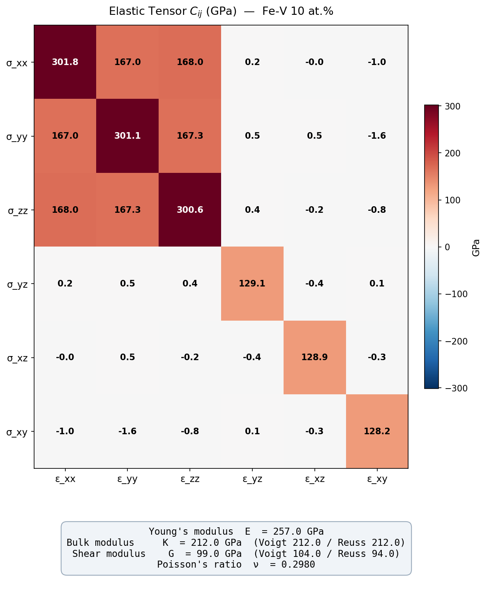

# Elastic Tensor Calculator — Fe-V Alloy

Computes the full **6×6 elastic tensor** (C_ij) of an Fe-V alloy supercell using
classical molecular dynamics via LAMMPS, then derives polycrystalline moduli and
produces visualizations.

---

## What is an elastic tensor?

When you push or twist a material, it deforms. The elastic tensor C_ij describes
*how much stress* (force per area) results from a given *strain* (fractional
deformation). It is a 6×6 matrix written in **Voigt notation**:

```
indices:  xx  yy  zz  yz  xz  xy
           1   2   3   4   5   6
```

For a cubic crystal like BCC iron there are only 3 independent values:
C11 (normal), C12 (cross-normal), C44 (shear). In an alloy the symmetry is
partially broken, but the matrix stays close to cubic.

---

## Method

**Central finite differences on stress**

For each of the 6 Voigt strain directions j:

1. Start from a fully relaxed ground-state supercell (box + atoms both at 0 pressure).
2. Apply a small strain +δ, relax atom positions (box shape fixed), record stress σ⁺.
3. Apply −δ, relax, record stress σ⁻.
4. Compute the column: `C[:,j] = (σ⁺ − σ⁻) / (2δ)`

Repeating for all 6 directions fills the full matrix. The matrix is then symmetrized
`C = (C + Cᵀ) / 2` to enforce physical symmetry.

**Why central differences?** Averaging +δ and −δ cancels first-order errors, giving
second-order accuracy with a single perturbation magnitude δ = 10⁻³.

---

## From single-crystal to polycrystalline moduli

A real engineering sample is polycrystalline — grains point in random directions.
**Voigt-Reuss-Hill (VRH)** averaging gives upper and lower bounds then takes the mean:

| Quantity | Formula source |
|---|---|
| Voigt (upper bound) | Assumes uniform strain across grains |
| Reuss (lower bound) | Assumes uniform stress across grains |
| Hill average | Arithmetic mean of Voigt and Reuss |

Output moduli:

| Symbol | Name | Meaning |
|---|---|---|
| E | Young's modulus | Stiffness under uniaxial pull |
| K | Bulk modulus | Resistance to uniform compression |
| G | Shear modulus | Resistance to shape change |
| ν | Poisson's ratio | Lateral squeeze when pulled axially |

---

## Configuration

All tunable parameters live at the top of `elastic.py`:

```python
CONFIG = {
    "potential_file":    "EAM/VFe_mm.eam.fs",  # interatomic potential
    "potential_elements":"V Fe",
    "lattice_const":     2.87,                  # Å, BCC Fe
    "supercell":         (5, 5, 5),             # ~250 atoms
    "dopant_fraction":   0.10,                  # 10 at.% V
    "delta":             1e-3,                  # strain perturbation magnitude
    ...
}
```

The potential uses the **EAM/FS** (Embedded Atom Method / Finnis-Sinclair) format,
which describes metallic bonding through an electron density embedding function.

---

## Files

| File | Role |
|---|---|
| `elastic.py` | Main calculation: builds supercell, applies strains, computes C_ij, VRH averaging |
| `viz.py` | Visualization: heatmap PNG + OVITO deformation animation |
| `run.sh` | One-shot runner: calls `elastic.py` then `viz.py` |
| `test_elastic.py` | Unit + integration tests (pytest) |
| `Cij.npy` | Saved 6×6 elastic tensor (NumPy array, GPa) |
| `moduli.npy` | Saved polycrystalline moduli dict (GPa) |
| `Cij_heatmap.png` | Heatmap of C_ij with moduli summary |
| `deformation.mp4` | OVITO animation of the 18 strain frames |
| `elastic_frames.lammpstrj` | Raw LAMMPS trajectory (18 snapshots: 6 columns × 3 frames each) |

---

## How to run

```bash
# From the Elastic/ directory
bash run.sh
```

This runs `elastic.py` (≈ minutes, 6 LAMMPS calculations) and then `viz.py`.

To run tests only:

```bash
OMP_NUM_THREADS=1 python -m pytest test_elastic.py -v
```

Dependencies: **LAMMPS** Python bindings, **NumPy**, **Matplotlib**, **OVITO** (for video).

---

## Results — Fe-V 10 at.% (5×5×5 supercell)

### Elastic tensor C_ij (GPa)

```
          xx      yy      zz      yz      xz      xy
  xx    301.8   167.0   168.0     0.2    -0.0    -1.0
  yy    167.0   301.1   167.3     0.5     0.5    -1.6
  zz    168.0   167.3   300.6     0.4    -0.2    -0.8
  yz      0.2     0.5     0.4   129.1    -0.4     0.1
  xz     -0.0     0.5    -0.2    -0.4   128.9    -0.3
  xy     -1.0    -1.6    -0.8     0.1    -0.3   128.2
```

The near-diagonal structure (C11 ≈ 301, C12 ≈ 167, C44 ≈ 129) confirms BCC cubic
symmetry is well-preserved despite 10% V substitution. Off-diagonal shear terms
are small (~1 GPa), reflecting mild symmetry breaking from random V placement.

### Polycrystalline moduli (VRH)

| Modulus | Value |
|---|---|
| Young's E | **257.0 GPa** |
| Bulk K (Hill) | **212.0 GPa** |
| Shear G (Hill) | **99.0 GPa** |
| Poisson ν | **0.298** |

The tensor is positive-definite (all eigenvalues > 0) — mechanically stable.
Hill bounds satisfied: G_R (94) ≤ G_H (99) ≤ G_V (104) GPa.

### Heatmap


